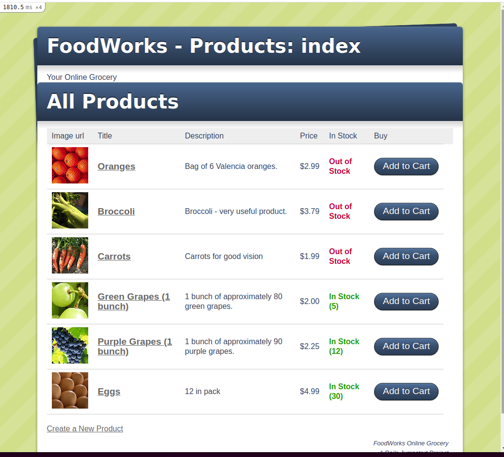

# README

This is a small project for a small online store.
- The creation of new products with the product image
- display in the list of products, 
- the product card, 
- the list of orders, 
- the order card, 
- the function of check of the remains of a product are developed.
- Implemented the twitter-omniauth

rails generate migration add_[name]_to_[table] [column_name]:[column_type]

* Ruby version - `2.7.2`
- Rails version - `6.1.4.1`
- Postgres: >=9.5

* Clone this repo
- `https://github.com/Laguna1/merchant`
- `cd Model-with-roles-2` 

* System dependencies
- `bundle install`
* Configuration

* Database creation
- `rails db:create`

* Database initialization
- `rails db:migrate`

* Start server
- `rails s`
- Open `http://localhost:3000/` in your browser

### Author

👤 **Oksana Petrova**

- GitHub: [@github/Laguna1](https://github.com/Laguna1)
- Linkedin: [linkedin/OksanaPetrova](https://www.linkedin.com/in/oksana-petrova/)
- Twitter: [@OksanaP48303303](https://twitter.com/P01339534Oksana)

## 🤝 Contributing

Contributions, issues and feature requests are welcome!

Feel free to check the [issues page](https://github.com/Laguna1/merchant/issues).

## Show your support

Give a ⭐️ if you like this project!
